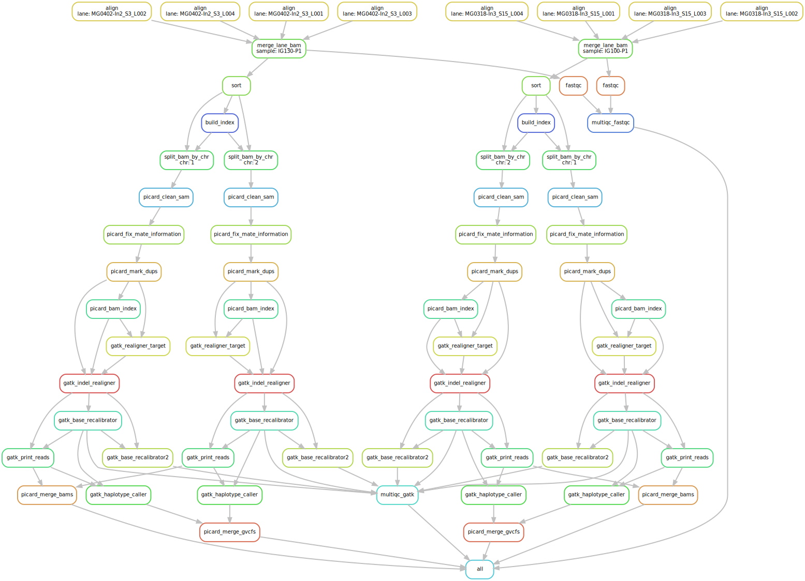
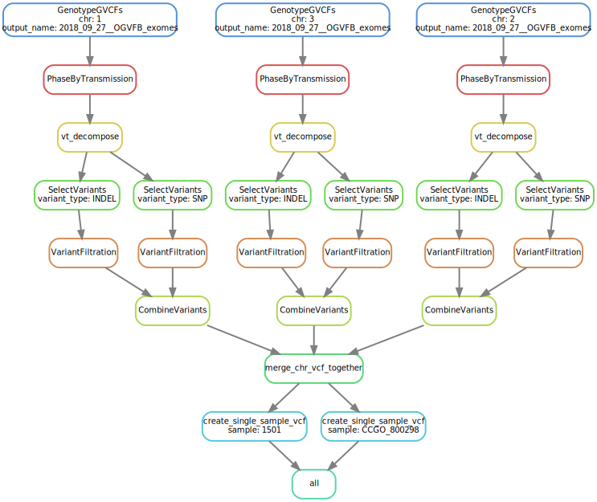

# Creating GVCF file(s) for each NGS sample

Based on [Snakemake](https://snakemake.readthedocs.io)

This is a template for processing *generic* NGS files you have. As there are several types of input you may have (cram/bam/fastq) and an *infinite* number of ways they can be named and organized the Snakefile will have to be tweaked for your usage. 

The output of this Snakemake pipeline are some QC stats (fastqc, GATK metrics) and a GVCF file for each sample. 

The current Snakefile is wrapped by [Snakemake.wrapper.sh](https://github.com/davemcg/NGS_genotype_calling/blob/master/NGS_generic/Snakemake.wrapper.sh), which will run the Snakefile pipeline on [biowulf2](hpc.nih.gov).

Each file will be processed by chromosome (chr1 through X,Y) individually. chrMT and the contigs are merged together and processed as one. This makes this pipeline *fairly* performant. A exome can be processed in hours and a WGS in less than 48 hours. 

A speed increase could be realized by subdividing the chromosome in [smaller pieces](https://gatkforums.broadinstitute.org/gatk/discussion/10215/intervals-and-interval-lists) - the Broad breaks WGS into something like 500 pieces. Something to do in the future. 

# File naming

Your fastq files (if that's the input) MUST have some kind of standard naming distinguishing forward / reverse at the end of the file.

Good:
 - `sample1.R1.fastq.gz`
 - `sample1.R2.fastq.gz`
 
Bad:
  - `run1026_lane12_read1_index8=sample1-1035582785.fastq.gz`
  - `run1026_lane12_read2_index8=sample1-1035582785.fastq.gz`

# How to run
1. Edit [metadata_file.csv](metadata_file.csv) with the sample lane, each lane bam, and the read groups you would like to add
2. Tweak the [yaml](config.yaml) to:
  - match the forward / reverse notation used. For the Good example above, you would use `['R1','R2']`
  - Give path and name for the [metadata_file.csv](metadata_file.csv)
3. Run with sbatch --time=SOMETHING ~/git/NGS_genotype_calling/NGS_generic/Snakemake.wrapper.sh config.yaml

# How to get from the GVCF to a single, filtered VCF?

1. You need your GVCFs to all be in one folder. The next [Snakefile](../src/Snakefile_gvcf_to_vcf) requires that.
2. Copy and edit the [yaml](../src/Snakefile_gvcf_to_vcf_example_config.yaml)
3. Run with `sbatch --time=24:00:00 ~/git/NGS_genotype_calling/GVCF_to_VCF_snakemake.wrapper.sh Snakefile_gvcf_to_vcf_example_config.yaml`
