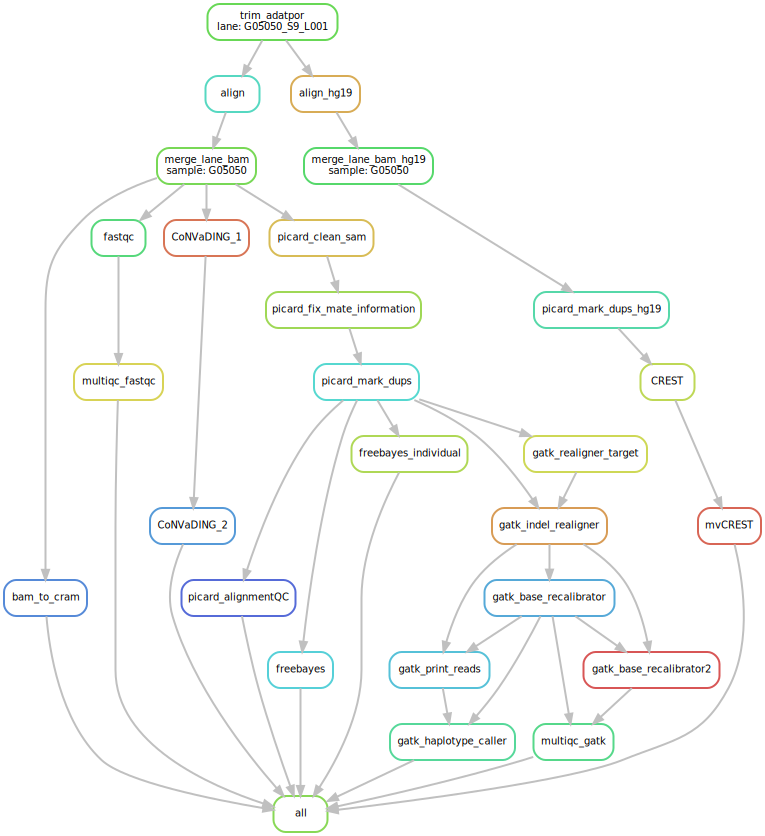

# Workflows to process raw sequence into VCF
- Forked over from https://github.com/davemcg/biowulf2-bin
a. fastq files have to be in the fastq folder. Bam support is not ready yet.
b. cp config_generic.yaml or config_panel.yaml to project folder.
c. panel or exome: sbatch --cpus-per-task=8 --mem=32g --time=12:0:0 config library panel/exome
  wgs: does not use localrules much, does not need specify cpus or mem

# For NISC exomes/WGS
- Refer to readme.md in NISC_workflow/

#Overview
1. (Re)Align with bwa-mem against 1000G GRCh37 with decoy
- NGS_generic_workflow/run_bwa-mem_hg37d5_fromBam.sh (if starting from a bam)
- NGS_generic_workflow/run_bwa-mem_hg37d5.sh (if starting from fastq)
2. Call GVCF with GATK (v3.5-0 right now)
- src/process_and_callGVCF.sh
3. Filter GVCF to a master VCF
- cp src/Snakefile_gvcf_to_vcf_example_config.yaml to your working directory
- mkdir GVCFs
- run `ln -s /path/to/your/gvcfs/*.raw.g.vcf GVCFs`
  - alternatively, just copy them, but that's not a great use of disk space
- edit Snakefile_gvcf_to_vcf_example_config.yaml to give ped path and whether you want VQSR or hard filtering (yaml file has some explanatory comments)
- run the Snakefile: `sbatch --time=24:00:00 ~/git/NGS_genotype_calling/GVCF_to_VCF_snakemake.wrapper.sh Snakefile_gvcf_to_vcf_example_config.yaml`
4. Annotate variants
- New repository: https://github.com/davemcg/variant_prioritization

# Visualization

